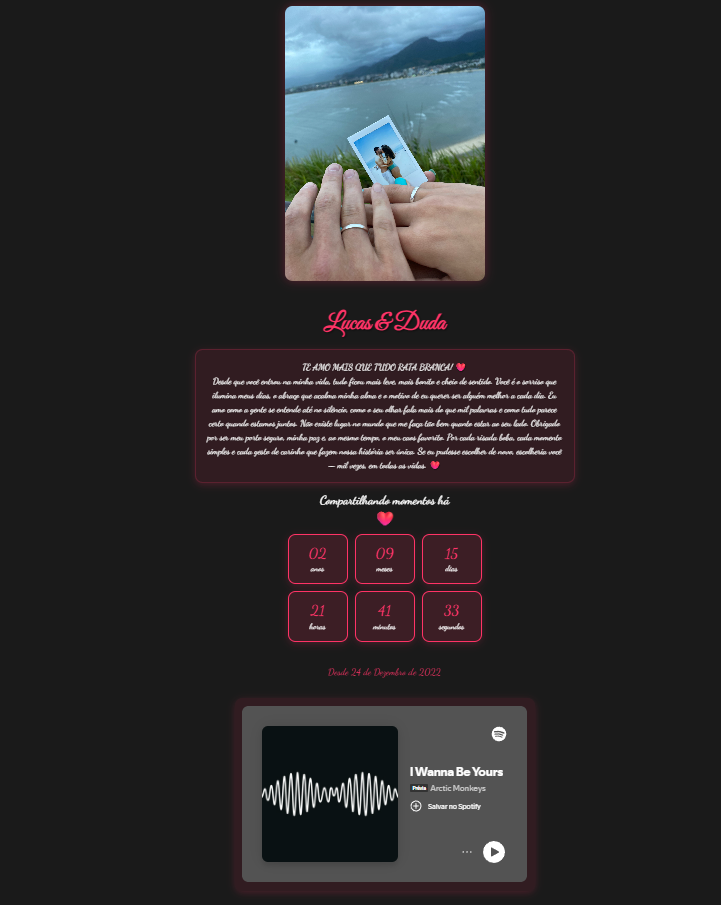

💖 Lucas & Duda — Nosso Cantinho do Amor

Um site romântico criado para celebrar o amor entre Lucas e Duda.
Desenvolvido com HTML, CSS e JavaScript, o projeto reúne fotos, música, efeitos animados e uma contagem do tempo juntos — tudo com muito carinho. 🌹

✨ Funcionalidades

🖼️ Carrossel de fotos com transições automáticas mostrando nossos momentos mais especiais.

🎵 Música de fundo com autoplay (ativada ao clicar na tela).

💘 Animação de corações caindo para um toque mágico.

🕒 Contador de tempo juntos, mostrando há quantos anos, meses, dias, horas, minutos e segundos estamos compartilhando o amor.

💌 Mensagem personalizada, escrita com todo o amor do mundo.

🛠️ Tecnologias Utilizadas

HTML5 — Estrutura principal do site

CSS3 — Estilo, sombras, efeitos e responsividade

JavaScript (puro) — Contadores, animações e interatividade

Google Fonts — Tipografia romântica (“Great Vibes” e “Dancing Script”)

📁 Estrutura do Projeto
/
├── index.html
├── foto1.jpg
├── foto2.jpg
├── ...
├── Arctic Monkeys - I Wanna Be Yours.mp3
└── README.md

💡 As imagens e o áudio devem estar na mesma pasta do arquivo index.html.

💞 Como Executar

Baixe ou clone o repositório.

Coloque suas fotos e música na mesma pasta do index.html.

Abra o arquivo index.html no navegador.

Clique na tela uma vez para liberar o som.

Pronto! Aproveite seu cantinho de amor. 💕

❤️ Feito com amor por

Lucas Santos — porque amar também é programar algo bonito pra quem a gente ama. 🥰
